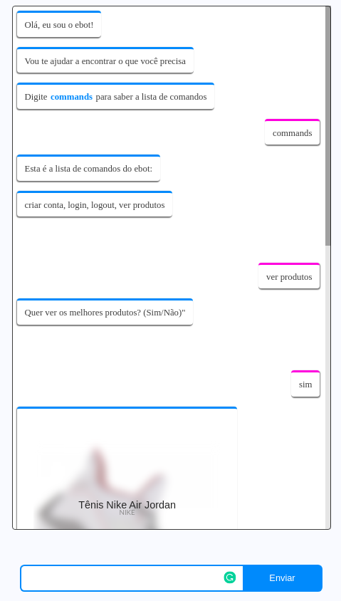

# Ecommerce chatbot

Ecommerce chatbot boilerplate



## Prerequisites
Make sure you have these requirements installed on your machine
* Node^8
* npm

## Installation

### NPM
Run:
```
$ npm i
$ npm start
$ npm run compile:sass // watch sass change
```

## Routes
* `/` - Render home template

### Database Queries
* `/users`  - [GET] Retrieves users by id ascending order
* `/users/:id` - [GET] Retrieves users by id param
* `/users/username/:username` - [GET] Retrieves users by username param
* `/products` - [GET] Retrieves products by id ascending order
* `/users`  - [POST] Creates new user data on database 
* `/users/:id` - [PUT] Updates user data on database


## Technologies used

* [Express](https://expressjs.com/) [ Fast, unopinionated, minimalist web framework for Node.js
 ]
* [Mustache Express](https://www.npmjs.com/package/mustache-express)
* [Node-sass](https://github.com/sass/node-sass) [ Binding for Node.js to LibSass ]
* [Node-postgres](https://www.npmjs.com/package/pg) [ Non-blocking PostgreSQL client for Node.js ]
